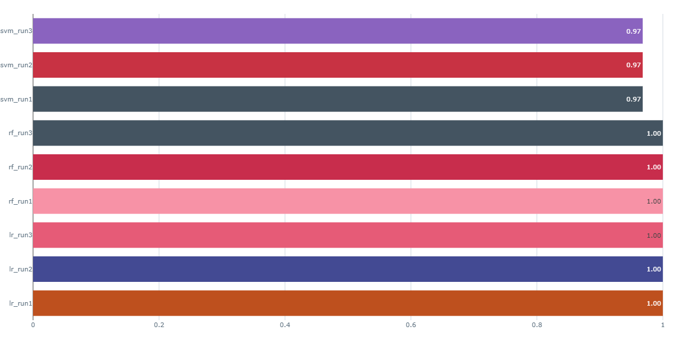
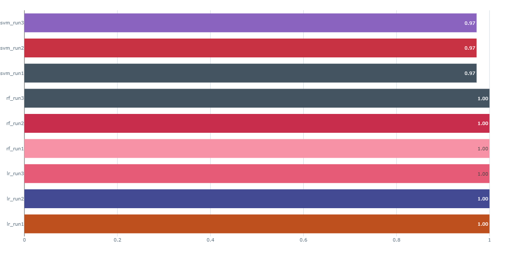
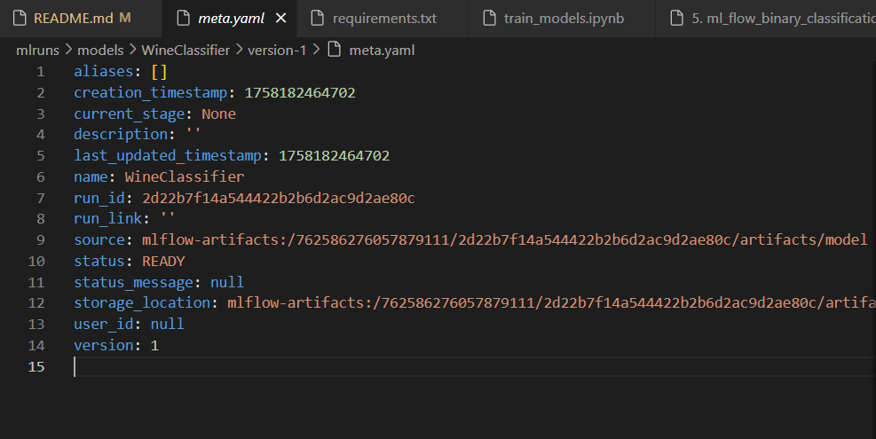

# MLOps Assignment 1 – GitHub Basics and MLflow Tracking

## 📌 Project Overview
This project was completed as part of **MLOps Assignment 1**.  
The purpose was to practice:
- Version control using **GitHub**  
- Building and comparing multiple **machine learning models**  
- Tracking experiments with **MLflow**  
- Registering the **best-performing model**

### ✨ Key Emphasis
- Reproducibility of results  
- Collaborative development workflows  
- Structured experiment tracking and monitoring  

---

## Repository Structure
```bash
mlops-assignment-1/
├── data/            # datasets
├── notebooks/       # Jupyter notebooks for experiments
├── src/             # source code files
├── models/          # saved trained models
├── results/         # logs, screenshots, evaluation outputs
└── README.md        # project documentation
```

##  GitHub Workflow

### Cloning the Repository
```bash
git clone https://github.com/IqraaAzam/mlops-assignment-1.git
``
Creating Feature Branches
```bash
git checkout -b feature/branch_name
```

Committing and Pushing Changes
```bash
git add .
git commit -m "Meaningful commit message"
git push origin feature/branch_name
```

+ Pull Requests and Merging

+ Created pull requests on GitHub

+ Merged feature branches into main

#### Pulling Updates
```bash
git pull origin main

```

Learning: Using branches, merging, cloning, pushing, and pulling ensures traceability, collaboration, and reproducibility, which are essential in MLOps workflows.

## 📊 Dataset

### Dataset Used: Wine Dataset (from scikit-learn)

#### Preprocessing

+ Train-test split with fixed random seed

+ Feature scaling to improve model performance for Logistic Regression and SVM

+ Placeholder: "Dataset Loading and Splitting


### Code to load and split dataset
```bash 
from sklearn.datasets import load_wine
from sklearn.model_selection import train_test_split
wine = load_wine()
X, y = wine.data, wine.target
X_train, X_test, y_train, y_test = train_test_split(X, y, test_size=0.2, random_state=42)
```

## Data Preprocessing
### Code for scaling or preprocessing data
```bash
from sklearn.preprocessing import StandardScaler
scaler = StandardScaler()
X_train = scaler.fit_transform(X_train)
X_test = scaler.transform(X_test)
```


## 🤖 Model Training and Comparison
### Evaluation Function

A reusable evaluation function was defined to:

+ Train models

+ Generate evaluation metrics

+ Save models and artifacts

#### Evaluation function for training and metrics
```bash
from sklearn.metrics import accuracy_score, precision_score, recall_score, f1_score, confusion_matrix, ConfusionMatrixDisplay
import joblib, matplotlib.pyplot as plt, os
def train_evaluate_save(model, model_name):
    model.fit(X_train, y_train)
    y_pred = model.predict(X_test)
    metrics = {
        'accuracy': accuracy_score(y_test, y_pred),
        'precision': precision_score(y_test, y_pred, average='macro'),
        'recall': recall_score(y_test, y_pred, average='macro'),
        'f1': f1_score(y_test, y_pred, average='macro')
    }
    os.makedirs('../models', exist_ok=True)
    joblib.dump(model, f'../models/{model_name}.pkl')
    cm = confusion_matrix(y_test, y_pred)
    disp = ConfusionMatrixDisplay(confusion_matrix=cm, display_labels=wine.target_names)
    disp.plot()
    plt.savefig(f'../results/{model_name}_confusion_matrix.png')
    plt.close()
    return metrics

```

Logistic Regression
### Logistic Regression training code
```bash
from sklearn.linear_model import LogisticRegression
lr = LogisticRegression(max_iter=1000)
lr_metrics = train_evaluate_save(lr, 'logistic_regression')
```

Random Forest
### Random Forest training code
```bash
from sklearn.ensemble import RandomForestClassifier
rf = RandomForestClassifier(n_estimators=100, random_state=42)
rf_metrics = train_evaluate_save(rf, 'random_forest')
```

Support Vector Machine (SVM)
### SVM training code
```bash
from sklearn.svm import SVC
svm = SVC(kernel='linear', random_state=42)
svm_metrics = train_evaluate_save(svm, 'svm')
```

Metrics and Comparison
### Code to save metrics and generate confusion matrices
```bash
import pandas as pd
metrics_df = pd.DataFrame([lr_metrics, rf_metrics, svm_metrics], index=['Logistic Regression', 'Random Forest', 'SVM'])
metrics_df.to_csv('../results/model_comparison.csv')
```


✅ Outcome: Logistic Regression (C = 1.0) outperformed the other models.

## 📈 MLflow Tracking and Logging
### MLflow Setup
```bash
pip install mlflow
mlflow ui
```
## Experiment Creation
### Code to create MLflow experiment
```bash
import mlflow
import mlflow.sklearn
mlflow.set_experiment("Wine Classification")
mlflow.set_tracking_uri("http://localhost:5000")
```

## Logging Function
### Parameters, metrics, artifacts, and models
```bash
def train_log_mlflow(model, model_name, params, experiment_name="Wine_Classification"):
    mlflow.set_experiment(experiment_name)
    with mlflow.start_run(run_name=model_name):
        mlflow.log_params(params)
        metrics = train_evaluate_save(model, model_name)
        for metric, value in metrics.items():
            mlflow.log_metric(metric, value)
        mlflow.log_artifact(f'../results/{model_name}_confusion_matrix.png')
        mlflow.sklearn.log_model(model, "model")
        return mlflow.active_run().info.run_id
```

# Logging Runs

## Logistic Regression Runs (different C values)

### Logistic Regression logging runs
```bash
lr_params1 = {'max_iter': 1000, 'C': 0.1}
lr_run1_id = train_log_mlflow(LogisticRegression(**lr_params1), 'lr_run1', lr_params1)  
lr_params2 = {'max_iter': 1000, 'C': 1.0}
lr_run2_id = train_log_mlflow(LogisticRegression(**lr_params2), 'lr_run2', lr_params2)  
lr_params3 = {'max_iter': 1000, 'C': 10.0}
lr_run3_id = train_log_mlflow(LogisticRegression(**lr_params3), 'lr_run3', lr_params3)  
```

## Random Forest Runs (different n_estimators)

### Random Forest logging runs
```bash
rf_params1 = {'n_estimators': 50, 'random_state': 42}
rf_run1_id = train_log_mlflow(RandomForestClassifier(**rf_params1), 'rf_run1', rf_params1)  
rf_params2 = {'n_estimators': 100, 'random_state': 42}
rf_run2_id = train_log_mlflow(RandomForestClassifier(**rf_params2), 'rf_run2', rf_params2)  
rf_params3 = {'n_estimators': 200, 'random_state': 42}
rf_run3_id = train_log_mlflow(RandomForestClassifier(**rf_params3), 'rf_run3', rf_params3)  
```

## SVM Runs (different C values)

### SVM logging runs
```bash
svm_params1 = {'kernel': 'linear', 'C': 0.1, 'random_state': 42}
svm_run1_id = train_log_mlflow(SVC(**svm_params1), 'svm_run1', svm_params1)  
svm_params2 = {'kernel': 'linear', 'C': 1.0, 'random_state': 42}
svm_run2_id = train_log_mlflow(SVC(**svm_params2), 'svm_run2', svm_params2)  
svm_params3 = {'kernel': 'linear', 'C': 10.0, 'random_state': 42}
svm_run3_id = train_log_mlflow(SVC(**svm_params3), 'svm_run3', svm_params3)  
```

### Comparing Runs

#### 📦 Model Monitoring and Registration
##### Monitoring Experiments

Runs were compared in MLflow UI to identify the best model.
   
Model Registration
### Code to register best model in MLflow Model Registry
```bash
run_id = lr_run2_id
mlflow.register_model(f"runs:/{run_id}/model", "WineClassifier")
```



✅ Result: Logistic Regression (C = 1.0) registered as WineClassifier v1.

## ⚙️ Reproducibility – Running the Project
### Step 1 – Clone the Repository
```bash
git clone https://github.com/IqraaAzam/mlops-assignment-1.git
cd mlops-assignment-1
```
### Step 2 – Install Dependencies
```bash
pip install -r requirements.txt
```
### Step 3 – Start MLflow Server
```bash
mlflow ui
```
### Step 4 – Run Training Notebook
```bash
jupyter notebook notebooks/train_models.ipynb
```
### Step 5 – View Results

Open MLflow UI in the browser

##### Compare runs and view logged metrics, parameters, and artifacts

## 📚 Key Learnings
### 🔹 GitHub and Version Control

+ Learned systematic use of cloning, branching, merging, and pulling

+ Understood the role of commits and pull requests in collaborative development

### 🔹 Machine Learning Models

+ Trained and evaluated Logistic Regression, Random Forest, and SVM

+ Observed how preprocessing and hyperparameters affect model performance

### 🔹 MLflow

+ Configured MLflow for experiment tracking

+ Logged parameters, metrics, artifacts, and models

+ Used MLflow UI to compare experiments effectively

### 🔹 Model Monitoring and Registration

+ Monitored experiments and identified the best model

+ Registered the model in MLflow Registry

# 🏆 Final Outcomes

### By the end of this project:

✅ Multiple machine learning models were trained and compared

✅ Parameters, metrics, and artifacts were logged using MLflow

✅ The best model was registered in MLflow Model Registry

✅ All code and documentation were version-controlled and published to GitHub