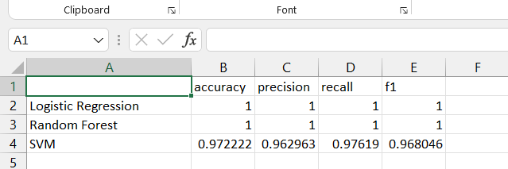

# MLOps Assignment 1\nSetup complete.

## Overview

This project implements MLOps Assignment 1, using the Wine dataset to train and compare ML models, track experiments with MLflow, and register the best model. Code was written from scratch in Python with scikit-learn. Feature branches and pull requests show merging effects. Multiple MLflow runs per model were logged for comparison.

Repository: https://github.com/[IqraaAzam]/mlops-assignment-1

# Problem Statement

Train and compare three ML models on the Wine dataset, log experiments with MLflow, register the best model, and ensure reproducibility.

# Project Structure
mlops-assignment-1/
├── data/               # Empty; .gitkeep for tracking
├── notebooks/          # train_models.ipynb
├── src/                # Scripts (if any)
├── models/             # Saved models
├── results/            # Plots, CSVs, screenshots
├── requirements.txt    # Dependencies
└── README.md           # This file

# Model Comparison
